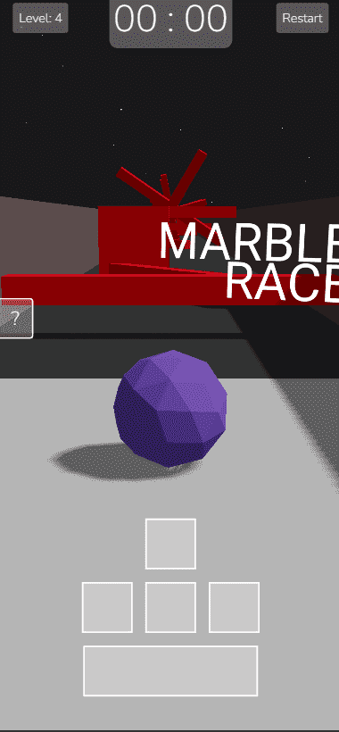

# ⚽ Marble Race Game

### Marble Race is a web-based game created using Three.js, offering an exhilarating experience in the genre of adventure and challenging games. In this game, players view various levels from the perspective of a marble. Along the path towards the finish line, they encounter different types of obstacles, which they must navigate through to reach the goal. A timer at the top of the page starts as soon as the game begins, motivating players to beat their previous records. Additionally, upon completing each level, players can progress to the next one, which is more challenging and contains more obstacles than the previous level.

## Link 🔗 [https://charactermi.github.io/marble-race](https://charactermi.github.io/marble-race)

 

# Preview

 

# Mobile Responsive

# Technologies

 

<ul>
    <li>
        
    </li>
    <li>
        
    </li>
    <li>
        
    </li>
    <li>
        
    </li>
    <li>
        
    </li>
</ul>
